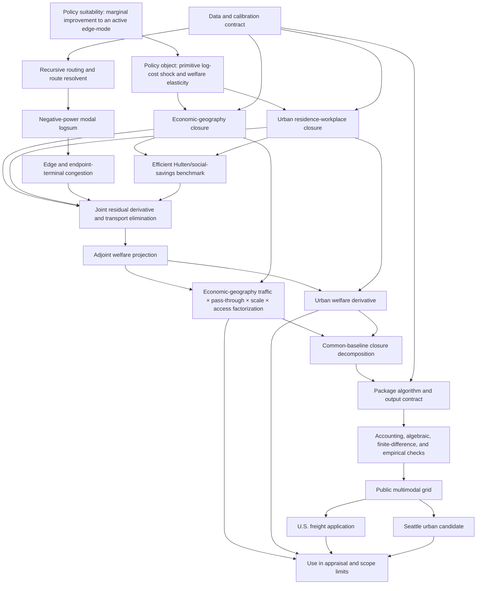

# Practitioner Guide Reasoning Map

Date: 2026-07-26

## Strongest reconstruction

The guide asks whether baseline traffic is sufficient to rank marginal
transport improvements. It first defines the primitive edge-mode policy and
the welfare elasticity to be reported. It then separates the spatial closure
from the transport block: economic geography maps trade costs into wages,
labor, and common utility, whereas the urban model maps commuting costs into
residence, workplace, and welfare choices; both use the same recursive routes,
negative-power modal logsum, and congestion maps. At an efficient interior
baseline, the envelope theorem makes edge-mode traffic the exact first-order
welfare statistic. With congestion or spatial externalities, the guide
differentiates the joint residual system, eliminates transport feedback by a
Schur complement, and projects policy forcing onto welfare with one adjoint
solve. The economic-geography derivative can then be factored into traffic,
primitive-cost pass-through, a common externality scale, and endpoint
market-access multipliers. Common-baseline closures identify congestion, mode,
and route differences without recalibrating the baseline. The remaining
sections turn these objects into a data contract, algorithm, diagnostic
protocol, reproducible grid example, and external-data applications. The
conclusion restricts the output to local model-implied benefits rather than a
complete project appraisal.

## Directed semantic graph

## Argument branches

1. **Appraisal branch:** policy elasticity -> money-metric normalization ->
   omitted benefits and costs -> project NPV.
2. **Data branch:** raw transport records -> documented preprocessing ->
   model-ready margins and flows -> accounting and route reconstruction.
3. **Theory branch:** efficient traffic benchmark -> IFT correction ->
   economic-geography factorization or urban welfare projection -> closure
   decomposition.
4. **Reproducibility branch:** configuration and inputs -> manifest and
   hashes -> deterministic artifacts -> restricted-data boundary.

The branches reunite in the final interpretation: a reported link elasticity
is usable only when its policy unit, spatial closure, baseline construction,
numerical checks, and omitted appraisal channels are stated together.

## Graph artifacts

The `structural-final/` directory contains the semantic hierarchy and sequence
graph produced during the full writing pass. After the incremental
reconciliation, a fresh deterministic skeleton of the expanded TeX source
contains 417 paragraphs, 1,410 sentences, 13 displayed equations, one
proposition, 16 figures, and 10 tables. The semantic files in this directory
add dependencies, section contracts, mathematical result cards, and the
editorial repair ledger that deterministic parsing cannot infer.
